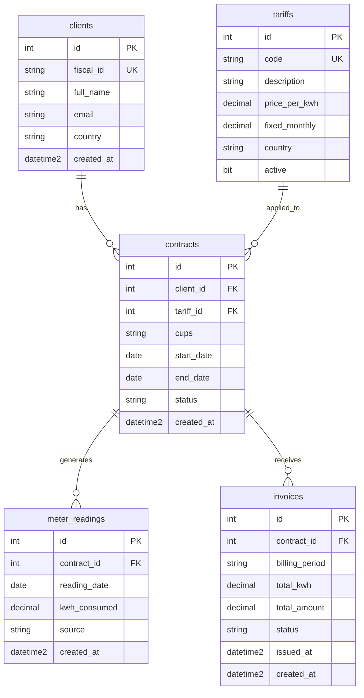

# PHP Assessment

## Model



## Exercise 1

### Exercise 1.1

1. List all active contracts with their client name, tariff code, and total kWh consumed in the current year. Order by total kWh descending. (Hint: you will need to JOIN multiple tables.)

```sql
SELECT 
    cl.full_name,
    t.code,
    SUM(mr.kwh_consumed) AS total_kwh
FROM contracts c
JOIN clients cl ON c.client_id = cl.id
JOIN tariffs t ON c.tariff_id = t.id
-- Use LEFT JOIN in order to include the actived contrantcs without reading for
-- for this year
LEFT JOIN meter_readings mr ON c.id = mr.contract_id 
    AND YEAR(mr.reading_date) = YEAR(GETDATE())
WHERE c.status = 'active'
GROUP BY cl.full_name, t.code
ORDER BY total_kwh DESC;
```
> **_Notes_**: Use the YEAR function to determine the year based on the reading_date, and GETDATE() to determine the system date.

2. For each country ('ES' and 'PT'), find the total number of active contracts 
and the average monthly consumption (kWh) over the last 6 months.

```sql
SELECT 
    cl.country,
    COUNT(DISTINCT c.id) AS total_active_contracts,
    AVG(monthly_usage.total_month_kwh) AS avg_monthly_consumption
FROM clients cl
JOIN contracts c ON cl.id = c.client_id
LEFT JOIN (
    SELECT 
        contract_id, 
--      Create format year-month to apply in group by       
        FORMAT(reading_date, 'yyyy-MM') AS month_key,
        SUM(kwh_consumed) AS total_month_kwh
    FROM meter_readings
    WHERE reading_date >= DATEADD(MONTH, -6, GETDATE())
--  The group by is for contract and year-month, to avoid multiples readings in the
--  same month
    GROUP BY contract_id, FORMAT(reading_date, 'yyyy-MM')
) AS monthly_usage ON c.id = monthly_usage.contract_id
WHERE c.status = 'active'
AND cl.country IN ('ES', 'PT')
GROUP BY cl.country;
```
> **_Notes_**: I used a subquery to ensure that only contracts with readings were included. Using a LEFT JOIN directly would affect the measurement of the average; it is probable that there are contracts without readings that affect the calculation.

3. Find all clients who have at least one contract but have NEVER received an invoice. 
Return: client name, fiscal_id, and contract count.

```sql
SELECT 
    cl.full_name,
    cl.fiscal_id,
    COUNT(c.id) AS contract_count
FROM clients cl
JOIN contracts c ON cl.id = c.client_id
LEFT JOIN invoices i ON c.id = i.contract_id
WHERE i.id IS NULL
GROUP BY cl.full_name, cl.fiscal_id;
```
> **_Notes_**: Basicly is create a LEFT JOIN to invoice table and search for nulls.

### Exercise 1.2

Design a stored procedure called sp_GenerateInvoice that:

- Receives @contract_id INT and @billing_period VARCHAR(7) (e.g. '2026-02').
- Checks that the contract is active and no invoice already exists for that period.
- Calculates the invoice:
total_kwh = SUM of meter_readings for that contract in that month
total_amount = (total_kwh * tariff.price_per_kwh) + tariff.fixed_monthly
- Inserts a new invoice with status 'draft'. Returns the created invoice data.
- Handles errors: what happens if there are no readings for the period? What if the contract does not exist?
Use TRY/CATCH.

[Link to code...](https://github.com/AFelipeTrujillo/php-factorenergia-assessment/blob/main/part1-sql/exercise_1_2.sql)

[Link to code...](https://github.com/AFelipeTrujillo/php-factorenergia-assessment/blob/main/part1-sql/exercise_1_2.sql)

[Link to code...](https://github.com/AFelipeTrujillo/php-factorenergia-assessment/blob/main/part1-sql/exercise_1_2.sql)

### Exercise 1.3

1. Index on `contracts`

```sql
CREATE INDEX IX_contracts_status_client ON contracts (status, client_id) INCLUDE (tariff_id);
```

**_Why_**: First, create an index by `status` and `client_id`. When queries filtering contracts by `status = 'active'` discard the inactive ones automatically. In addtion, I suggest include the `tariff_id` and reduce timing to get the tariff.

2. Index on `meter_readings`

```sql
CREATE INDEX IX_meter_readings_contract_date ON meter_readings (contract_id, reading_date) INCLUDE (kwh_consumed);
```

**_Why_**: The `meter_readings` table should be critical with thousands or millions of rows. I consider the filter `contrant_id` by `reading_date` to be a recurring query. Creating an index and including kwh_consumed could to make faster the `SUM()` by period.

3. Index on `invoices`

```sql
CREATE UNIQUE INDEX IX_invoices_contract_period ON invoices (contract_id, billing_period);
```
