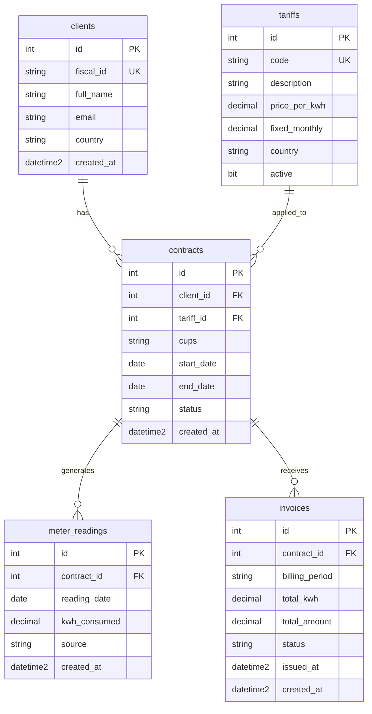
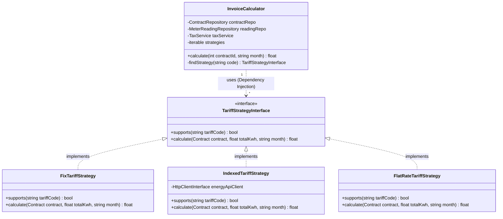

# PHP Assessment

## Model



## Exercise 1

### Exercise 1.1

1. List all active contracts with their client name, tariff code, and total kWh consumed in the current year. Order by total kWh descending. (Hint: you will need to JOIN multiple tables.)

```sql
SELECT 
    cl.full_name,
    t.code,
    SUM(mr.kwh_consumed) AS total_kwh
FROM contracts c
JOIN clients cl ON c.client_id = cl.id
JOIN tariffs t ON c.tariff_id = t.id
-- Use LEFT JOIN in order to include the actived contrantcs without reading for
-- for this year
LEFT JOIN meter_readings mr ON c.id = mr.contract_id 
    AND YEAR(mr.reading_date) = YEAR(GETDATE())
WHERE c.status = 'active'
GROUP BY cl.full_name, t.code
ORDER BY total_kwh DESC;
```
> **_Notes_**: Use the YEAR function to determine the year based on the reading_date, and GETDATE() to determine the system date.

2. For each country ('ES' and 'PT'), find the total number of active contracts 
and the average monthly consumption (kWh) over the last 6 months.

```sql
SELECT 
    cl.country,
    COUNT(DISTINCT c.id) AS total_active_contracts,
    AVG(monthly_usage.total_month_kwh) AS avg_monthly_consumption
FROM clients cl
JOIN contracts c ON cl.id = c.client_id
LEFT JOIN (
    SELECT 
        contract_id, 
--      Create format year-month to apply in group by       
        FORMAT(reading_date, 'yyyy-MM') AS month_key,
        SUM(kwh_consumed) AS total_month_kwh
    FROM meter_readings
    WHERE reading_date >= DATEADD(MONTH, -6, GETDATE())
--  The group by is for contract and year-month, to avoid multiples readings in the
--  same month
    GROUP BY contract_id, FORMAT(reading_date, 'yyyy-MM')
) AS monthly_usage ON c.id = monthly_usage.contract_id
WHERE c.status = 'active'
AND cl.country IN ('ES', 'PT')
GROUP BY cl.country;
```
> **_Notes_**: I used a subquery to ensure that only contracts with readings were included. Using a LEFT JOIN directly would affect the measurement of the average; it is probable that there are contracts without readings that affect the calculation.

3. Find all clients who have at least one contract but have NEVER received an invoice. 
Return: client name, fiscal_id, and contract count.

```sql
SELECT 
    cl.full_name,
    cl.fiscal_id,
    COUNT(c.id) AS contract_count
FROM clients cl
JOIN contracts c ON cl.id = c.client_id
LEFT JOIN invoices i ON c.id = i.contract_id
WHERE i.id IS NULL
GROUP BY cl.full_name, cl.fiscal_id;
```
> **_Notes_**: Basicly is create a LEFT JOIN to invoice table and search for nulls.

### Exercise 1.2

Design a stored procedure called sp_GenerateInvoice that:

- Receives @contract_id INT and @billing_period VARCHAR(7) (e.g. '2026-02').
- Checks that the contract is active and no invoice already exists for that period.
- Calculates the invoice:
total_kwh = SUM of meter_readings for that contract in that month
total_amount = (total_kwh * tariff.price_per_kwh) + tariff.fixed_monthly
- Inserts a new invoice with status 'draft'. Returns the created invoice data.
- Handles errors: what happens if there are no readings for the period? What if the contract does not exist?
Use TRY/CATCH.

[Link to code...](https://github.com/AFelipeTrujillo/php-factorenergia-assessment/blob/main/part1-sql/exercise_1_2.sql)

### Exercise 1.3

1. Index on `contracts`

```sql
CREATE INDEX IX_contracts_status_client ON contracts (status, client_id) INCLUDE (tariff_id);
```

> **_Why_**: First, create an index by `status` and `client_id`. When queries filtering contracts by `status = 'active'` discard the inactive ones (cancelled and pending) automatically. In addtion, I suggest include the `tariff_id` and reduce timing to get the tariff.
> 

2. Index on `meter_readings`

```sql
CREATE INDEX IX_meter_readings_contract_date ON meter_readings (contract_id, reading_date) INCLUDE (kwh_consumed);
```

> **_Why_**: The `meter_readings` table should be critical with thousands or millions of rows. I consider the filter `contrant_id` by `reading_date` to be a recurring query. Creating an index and including kwh_consumed could to make faster the `SUM()` by period.
> 

3. Index on `invoices`

```sql
CREATE UNIQUE INDEX IX_invoices_contract_period ON invoices (contract_id, billing_period);
```

> **_Why_**: Create a unique index between `contract_id` and `billing_period` to avoid creating duplicates. This will prevent the creation of two or more invoices for the same period and contract. 
>

## Exercise 2

### 2.1 Code Review

In the next code, I marked all issues that considered important. 

[Link to code review...](https://github.com/AFelipeTrujillo/php-factorenergia-assessment/blob/main/part2-php/2_review/InvoiceCalculatorWithCodeReview.php)

Some points:

* **SQL Injection**: This is the most critical issue. Variables like `$contractId` and `$month` are concatenated directly into the SQL strings. Fix: Use prepare SQL sintax or ORM

* **Errors via echo**: A service class should never use echo (intead of use loggin). This breaks the separation of concerns. Fix: Use Exceptions or return a Response object.

* **Violation of OCP (Open/Closed Principle)**: Every time FactorEnergia adds a new tariff, you must modify the if/elseif block. This makes the class grow indefinitely and increases the risk of introducing bugs in existing tariffs. **Fix**: Create strategies per each tariff (_Strategy Pattern_).

* **Type Hinting**: There is a lack of type-hinting in the return and function parameters. Make the code clearer and more readable.

* **Insert Validation**: After the insert/update, validate that the data has been inserted into the database and use transaction staments.

### 2.2 Refactoring

[Link to refactoring code...](https://github.com/AFelipeTrujillo/php-factorenergia-assessment/blob/main/part2-php/3_refactoring/)

#### The Strategy Pattern applies to Tariffs.



#### Unit Test

I consider creating unit tests for:

* Each tariff strategy focuses on the `IndexedTariffStrategy`, which depends on an external service.
* Ensure the system throws an exception and logs an error if a Contract is not found.
* Ensure `entityManager->persist()` and `flush()` are called at the end of a successful cycle. PHPUnit can mock the `EntityManager`and validate the execution.

## Exercise 3

### 3.1 Data Model

Define the entity/model for storing the result of each synchronization attempt, using your chosen framework (Doctrine ORM for Symfony or ActiveRecord for Yii2). It should store:
- The local contract ID
- The ERSE external ID (if successful)
- The sync status (pending, success, failed)
- The response received from ERSE (for debugging)
- Created and updated timestamps

[Link to Data Model](https://github.com/AFelipeTrujillo/php-factorenergia-assessment/blob/main/part3-api/ErseSyncLog.php)

### 3.2 Serivice Class

Implement a service class (e.g. ErseSyncService) that:
- Receives a contract ID
- Loads the contract from the database
- Transforms the data into the format expected by the ERSE API
- Sends the HTTP request (use Guzzle, Symfony HttpClient, or Yii2's HTTP client -- your choice)
- Handles the different responses (201, 400, 409, 500) and updates the sync record accordingly

[Link to Serivice Class](https://github.com/AFelipeTrujillo/php-factorenergia-assessment/blob/main/part3-api/ErseSyncService.php)

### 3.3 Controller

Implement the endpoint POST /api/contracts/sync that:
- Accepts a JSON payload with: contract_id (int)
- Validates that the contract exists and belongs to Portugal (country = 'PT')
- Calls the sync service
- Returns appropriate HTTP responses (success, not found, already synced, etc.)

[Link to Controller](https://github.com/AFelipeTrujillo/php-factorenergia-assessment/blob/main/part3-api/ContractSyncController.php)

### 3.4 Written Questions

1. **How would you prevent the same contract from being synced twice simultaneously (e.g. if someone clicks the button twice quickly)?**

To prevent one contract being synced more than once, I suggest using the `Locks` of Symfony. This component lets the service block a specific database resource (e.g a Contract) using and external stogare. Creating a mark in a Text Plain File or Redis, which stops other processes when try to use it.

For example:
```php
// Create the lock
$lock = $this->lockFactory->createLock('erse-sync-' . $contractId);

// If acquire == false, the resource is blocked and stop the processs
if (!$lock->acquire()) {
    $this->logger->warning("Sync ignored: Contract {id} is already being processed.", ['id' => $contractId]);
    return;
}
// ...

// Relesase the resource.
$lock->release();

```

2. **If the ERSE API is temporarily down, what would you do with the sync request so it is not lost?**

Instead of processing the sync in the HTTP request in one thread of execution, I would use `Symfony Messenger`, for managing queues. The request would be stored as a `Message` in the queue. If the API is down, the worker will automatically use a Retry process to re-process the message later without losing the data. It can use a table from the database with `Symfony Messenger`, or set up to use `Redis` or `RabbitMQ`.

How looks the controller with a `MessageBusInterface`:

```php
#[Route('/api/contracts')]
class ContractSyncController extends AbstractController
{
    #[Route('/sync', name: 'api_contract_sync', methods: ['POST'])]
    public function sync(Contract $contract, MessageBusInterface $bus): JsonResponse    // <--- MessageBusInterface
    {
        // Use the dispatch function to sync the contract.
        $bus->dispatch(new SyncContractMessage($contract->getId()));

        return $this->json([
                'status' => 'processing',
                'message' => 'Sync is processing for contract ' . $contractId
            ], Response::HTTP_OK);
    }
}
```

3. **Where would you store the ERSE API URL and Bearer token in your framework? Why?**

I would store these sensitive values in Environment Variables (.env file) and inject them into the service via Symfony's Parameter. This ensures Security (secrets are not committed to Git thanks to `.gitignore`) and Environment Isolation, allowing us to use different credentials for Development, Staging, and Production without changing a single line of code. Other options is a use and external tools called `Vault` when the team uses lots of microservices. 
